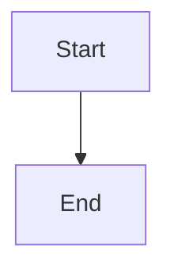

[ [Back to examples](./README.md) ]

---

# Feature Showcase
This page is generated by `examples/feature-showcase.js` and exercises every function `mr_markdown_builder` exports. Regenerate it with `node examples/feature-showcase.js` whenever the module changes.

## Headers

# h1 header

## h2 header

### h3 header

#### h4 header

##### h5 header

###### h6 header

###### hX(9, ...) clamps to h6

## Emphasis
* **bold** via b()
* _italic_ via i()
* ~~strikethrough~~ via s()
* `inline code` via ic()
```
const codeBlock = "via cb()"
```
```js
const codeBlock = "via cb(), with a language for syntax highlighting"
```

## Lists

### Unordered (ul)
* First item
* Second item

### Ordered (ol), with a callback
1. FIRST ITEM
2. SECOND ITEM

### Task list (tl), mixing plain strings and checked items
- [ ] Plain string items render unchecked
- [ ] Explicitly unchecked
- [x] Explicitly checked

### Nested lists (embed a rendered ul()/ol()/tl() in an item)
* Parent item
  * Nested A
  * Nested B

## Tables

### Default (unaligned) columns
 | Left | Center | Right | 
 |  ---  |  ---  |  ---  | 
 | a | b | c | 
 | d | e | f | 

### Per-column alignment
 | Left | Center | Right | 
 |  :---  |  :---:  |  ---:  | 
 | a | b | c | 
 | d | e | f | 

## Miscellaneous

### Links and images
*  [Explicit URL](https://github.com/mediumroast/mr_markdown_builder) 
*  [Falls back to an anchor when url is null](#falls-back-to-an-anchor-when-url-is-null) 
* 
* 

### Quote (multi-line)
>  Every line of this string
>  is prefixed with a blockquote marker.

### GitHub Alert
>  [!TIP]
>  alert() renders a [!TYPE] blockquote for NOTE/TIP/IMPORTANT/WARNING/CAUTION.

### Badges and tags
 

### Collapsible section


<details>
<summary>Click to expand</summary>

Hidden content lives here.
</details>

### Arrows and whitespace helpers
&#8593; &#8595; &#8592; &#8594;&nbsp;(space helper before this text)

### Text-level HTML: ins, sub, sup, and a hard break via br()
<ins>underlined</ins> <sub>sub</sub> <sup>sup</sup>  
This line follows a hard break.

### GitHub shorthand: mention, issueRef, emoji, colorSwatch
@octocat #42 :tada: `#1d9bf0`

### Math: mathInline and mathBlock
$E = mc^2$


$$
\sum_{i=1}^{n} i = \frac{n(n+1)}{2}
$$


### comment (renders nothing visible)
<!-- This is only visible in the raw markdown source. -->

### namedAnchor (a manual, non-heading anchor point)
<a name="showcase-anchor"></a>Linkable via  [#showcase-anchor](#showcase-anchor) 

### Footnotes: footnoteRef and footnoteDefs
A claim that needs a source[^1].
[^1]: The footnote definition, rendered wherever footnoteDefs() is called.

## GeoJSON / TopoJSON code blocks
```geojson
{
  "type": "Feature",
  "geometry": {
    "type": "Point",
    "coordinates": [
      -117.078046,
      32.934771
    ]
  },
  "properties": {
    "name": "Example point"
  }
}
```
```topojson
{
  "type": "Topology",
  "objects": {},
  "arcs": []
}
```

## Mermaid diagram

