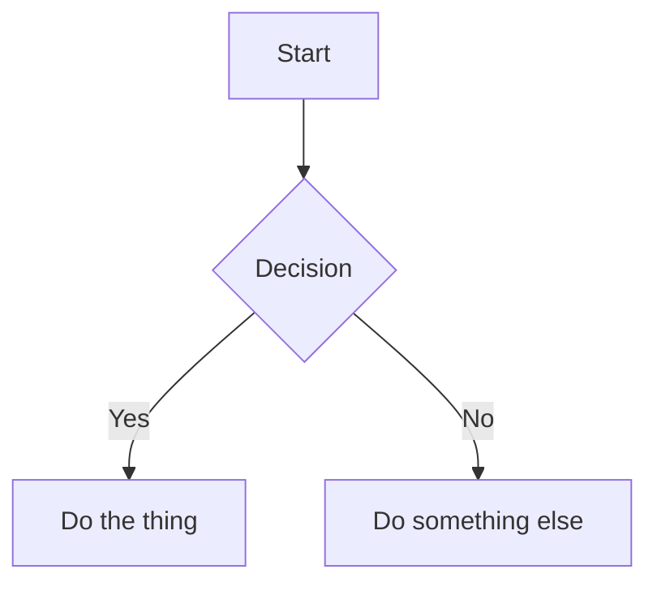

[ [Back to examples index](./INDEX.md) ]

---

# Diagrams: GeoJSON, TopoJSON & Mermaid
Generated by `examples/geoblocks-example.js`, covering `geojson`, `topojson`, and `mermaid`. GitHub renders fenced ```geojson``` blocks as an interactive map, and fenced ```mermaid``` blocks as a diagram, automatically.

## geojson()
```geojson
{
  "type": "Feature",
  "geometry": {
    "type": "Point",
    "coordinates": [
      -117.078046,
      32.934771
    ]
  },
  "properties": {
    "name": "Example location",
    "description": "A single point on the map."
  }
}
```

## topojson()
```topojson
{
  "type": "Topology",
  "objects": {
    "example": {
      "type": "GeometryCollection",
      "geometries": []
    }
  },
  "arcs": []
}
```

## mermaid()

